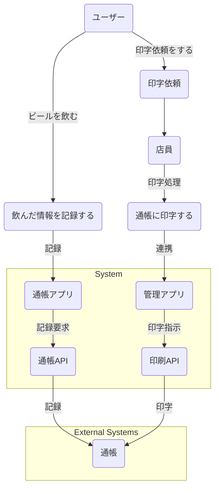

## コンセプト: クラフトビール通帳：飲むたびに思い出が貯まる、ワクワク収集体験！

クラフトビール通帳は、単なる記録ツールではありません。それは、あなたがこれまでに出会った個性豊かなクラフトビールとの**思い出を記帳し、未来へと積み重ねていくための特別な「通帳」**です。

この通帳を開くたびに、初めてそのビールを口にした時の驚きや感動、友人との語らい、旅先の風景など、**鮮やかな記憶が蘇るでしょう**。手書きで記帳するたびに「自分だけのビールヒストリー」が刻まれ、ページをめくるたびに、**飲んだビールの種類や金額（楽しさの証！）が増えていく**のを目にするのは、まるで預金残高が増えるかのようなワクワク感。通帳に記帳するために行列ができれば、周りの人は「あれは何だろう？」と興味津々。自然と会話が生まれ、**「なにそれ？何飲んだの？」と通帳をきっかけにビール談義に花が咲く**ことでしょう。

さらに、様々なデザインの通帳をコレクションする楽しみも。訪れる場所やイベントごとに異なる柄の通帳を集めれば、**あなたのビールライフがより一層彩り豊かになります**。

クラフトビール通帳は、ビールを「飲む」という行為を超え、**その場の雰囲気や人とのつながり、そして何よりも「思い出」を大切にする、あなたらしい楽しみ方を提案します**。さあ、あなただけのクラフトビール通帳を手に、最高のビール体験を始めてみませんか？

## ユースケース図

---

### ユースケース図の説明

この図は、**ビール通帳アプリ**のシステムが提供する機能と、それを利用する人や外部システムとの関係を図で示したものです。

### 登場人物（アクター）

- **ユーザー**: ビールを飲み、その情報を記録したり、通帳の印字を依頼したりする人です。
- **店員**: ユーザーからの通帳印字依頼を受け、実際に印字処理を行う人です。
- **通帳**: 飲んだ情報が記録される媒体です。
- **通帳アプリ**: ユーザーが飲んだ情報を記録したり、通帳APIと連携したりするアプリケーションです。
- **通帳API**: 通帳アプリからの記録要求を受け付け、通帳と連携するシステムです。
- **管理アプリ**: 店員が通帳印字の処理を行う際に使用するアプリケーションです。
- **印刷API**: 管理アプリからの印字指示を受け付け、通帳に情報を印刷するシステムです。

### 主なユースケース（機能）

図には大きく分けて2つの主要なユースケースが表現されています。

1.  **飲んだ情報を記録する**:
    - ユーザーがビールを飲んだ際、**通帳アプリ**を介して飲んだ情報を記録します。
    - **通帳アプリ**は**通帳API**に記録要求を送り、**通帳API**が**通帳**に飲んだ情報を記録します。

2.  **通帳に印字する**:
    - 飲んだ情報がある程度貯まると、ユーザーは**店員**に**通帳の印字依頼**をします。
    - **店員**は印字依頼を受け、**管理アプリ**を使って印字処理を行います。
    - **管理アプリ**は**印刷API**に印字指示を送り、**印刷API**が**通帳**に情報を印刷します。

### システムと外部システム

図の下部には、システムの構成を明確にするためのグループ分けがされています。

- **システムの世界**: **通帳アプリ**、**通帳API**、**管理アプリ**、**印刷API**といった、ビール通帳アプリの中核をなすソフトウェア要素が含まれます。
- **物理の世界**: **通帳**のように、アプリの機能に深く関わるものの、システム自体の一部ではない外部の要素が示されています。

## コンセプトシート

### コンセプトのイメージ

ユーザーに**楽しさ**と**ワクワク**を提供するアプリを目指します。クラフトビールの多様な世界を巡る冒険のような体験を創造し、新しいビールとの出会いや記録の過程そのものが喜びとなるように設計します。

### デザイン要素

#### 色

- **アプリ内カラーパレット:** 暖色系を基調とし、ビールを想起させる色合いを中心に構成します。具体的には、琥珀色、金色、茶色など、ビールの豊かな色合いを表現できるトーンを選定します。
- **ホームページとの一貫性:** アプリ内でも、ホームページの白黒モノトーンの要素を部分的に取り入れることで、ブランド全体の一貫性を確保します。例えば、背景色やアイコンの一部にモノトーンを使用したり、情報を際立たせるためのアクセントカラーとして暖色系を用いるなどの工夫が考えられます。
- **ラベルデザインとの連携:** アプリ内の特定のセクションや通知、限定コンテンツなどに、ラベルで使われている黄と青、赤と紫のようなツートーンカラーを効果的に活用します。これにより、ユーザーはアプリと現実のビールのラベルとの繋がりを感じやすくなります。

#### タイポグラフィ

- **フォントスタイル:** 丸みのない、はっきりとしたフォントを選定します。明朝体やゴシック体が候補となります。特に、情報の可読性を重視しつつ、クラフトビールの持つ職人的なこだわりや品質の高さを表現できるような、洗練された印象のフォントが望ましいです。

#### シンボル

- **初期フェーズ:** アプリのローンチ時は、**オリジナリティ**を重視したシンボルをデザインします。これは、アプリの独自性や革新性をアピールし、ユーザーの記憶に残るようなものであるべきです。
- **将来的な展望:** アプリが広く普及し、業界内で認知されるようになった際には、より**中立的**で普遍的なデザインのシンボルへの移行を検討します。これにより、より多くのユーザーに受け入れられやすく、長期的なブランド形成に貢献できるシンボルを目指します。

## 考慮事項

### 記帳について

ある程度情報が溜まると、取引履歴を紙の通帳に記録し、印字することができます。
悪意を持ったユーザーが別のユーザーを偽装して記帳しないようにすること。
また、その方式については問わない。

例えば、記帳リクエストにはQRを用い、それをタブレットで読み取りWindowsで印刷をかけるということも可能。

### 未成年かどうかの年齢確認

未成年者の飲酒を誘発する可能性を減らすため、未認証かつ年齢確認していない状態では年齢確認する。

たとえ販売していなくても、ウェブサイトがお酒に関わる内容を扱っている場合、未成年者へのアクセスを制限するよう配慮することが社会的責任。

## 構成

最初にランディングページで、アプリケーションにアクセスしようとしたら、ログイン画面、ログインしたらアプリケーション画面。
そこから新規作成や通帳の記帳ができます。
余計なページを省くことで説明がなくても使えるようなアプリケーションを。

技術的にはtRPCでTypeScriptスタック、スキーマを書くだけでクライアントの方にも型情報が伝えられる時代
さらに、Tanstack QueryやSuspenseも使えばロードしているかどうかのために状態切る必要もない
そしてモノレポ、ローカルで動かすのかクラウドなのかも管理する最先端の構成。
もともと環境変数で機能管理していたが、それでもバンドルされるときに使われない機能も含まれてしまう。
モノレポならバンドルされずに高速に動作できる。
